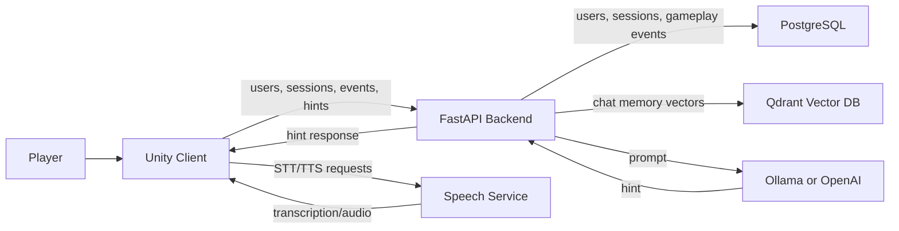

# Context-Aware Virtual Assistant

A master's dissertation prototype that integrates a contextual AI assistant into an interactive Unity environment. The project demonstrates how gameplay telemetry, scene-specific knowledge, conversational memory, speech interaction, and large language models can be combined to provide short, relevant, player-facing assistance during gameplay.

## Project Goal

The goal of this project is to build a virtual assistant that can understand what the player is doing inside a Unity scene and generate useful contextual hints without hard-coding every response in the game client.

The prototype focuses on a pipe-placement puzzle. The player interacts with pipes and slots in a 3D environment, while the Unity client continuously sends gameplay context to a Python backend. The backend combines this context with scene knowledge, conversation memory, and an LLM provider to generate responses that help the player progress.

The system was designed so that puzzle-specific knowledge is not embedded directly into backend logic. Instead, Unity sends a `puzzle_knowledge.json` file describing the current puzzle. This makes the assistant more reusable: a different scene can provide a different knowledge file while keeping the same backend architecture.

## Main Features

- Unity-based interactive pipe puzzle prototype
- Text chat interface for asking the assistant questions
- Optional voice interaction with speech-to-text and text-to-speech
- FastAPI backend for users, sessions, gameplay events, context building, and hint generation
- PostgreSQL storage for relational data and gameplay telemetry
- Qdrant vector database for semantic chat memory
- OpenAI embeddings for conversation memory retrieval
- LLM provider abstraction with support for Ollama and OpenAI
- Scene-specific knowledge loaded from Unity `Resources`
- Contextual prompt construction using gameplay events, scene state, semantic memory, and puzzle rules
- Defensive fallback behavior when LLM generation fails

## Architecture Overview



## How the Hint Flow Works

1. The player interacts with the Unity scene.
2. Unity logs gameplay events such as looking at objects, picking up pipes, placing pipes, and dropping pipes.
3. Unity sends recent events and session data to the FastAPI backend.
4. When the player asks a question, Unity sends:
   - the user message
   - the current session ID
   - the selected LLM provider
   - the loaded puzzle knowledge
5. The backend retrieves recent gameplay events from PostgreSQL.
6. The backend searches Qdrant for semantically relevant previous chat messages for the same user and session.
7. The backend builds a prompt from:
   - the current user message
   - scene state
   - recent gameplay context
   - puzzle knowledge
   - relevant conversation memory
8. The selected LLM provider generates a short player-facing hint.
9. The user and assistant messages are embedded and stored in Qdrant.
10. Unity displays and optionally speaks the response.

## Data Storage Responsibilities

The project separates relational gameplay data from semantic conversation memory.

| System | Responsibility |
| --- | --- |
| PostgreSQL | Users, sessions, gameplay events, session metadata |
| Qdrant | User and assistant chat messages, vector embeddings, semantic retrieval |
| Unity Resources | Scene-specific puzzle knowledge |

Gameplay events are intentionally not stored in Qdrant. They remain in PostgreSQL because they are structured relational telemetry. Qdrant is used only for semantic chat memory.

## Repository Structure

```text
.
|-- Backend/
|   |-- backend_service/
|   |   |-- app/
|   |   |   |-- core/              # Config, PostgreSQL, Qdrant setup
|   |   |   |-- embeddings/        # Embedding provider abstraction
|   |   |   |-- llm/               # Ollama and OpenAI LLM providers
|   |   |   |-- models/            # SQLAlchemy models and Pydantic schemas
|   |   |   |-- repositories/      # Data access layer
|   |   |   |-- routes/            # FastAPI routes
|   |   |   `-- services/          # Context, prompt, memory, hint logic
|   |   |-- requirements.txt
|   |   `-- Dockerfile
|   |-- speech_service/
|   |   |-- app/
|   |   |   |-- routes/            # STT and TTS endpoints
|   |   |   `-- speech/            # Provider interfaces and implementations
|   |   |-- requirements.txt
|   |   `-- Dockerfile
|   |-- docker-compose.yml
|   `-- run.sh
|-- Unity Client/
|   |-- Assets/
|   |   |-- Resources/
|   |   |   `-- Knowledge/
|   |   |       `-- puzzle_knowledge.json
|   |   `-- Scripts/
|   |       |-- API/               # Backend and speech API clients
|   |       |-- Context/           # Gameplay event and scene-state logging
|   |       |-- LLM/               # Provider selection
|   |       |-- Managers/          # Chat, voice, user, session managers
|   |       |-- Pipes/             # Pipe and slot logic
|   |       |-- Player/            # Movement and interaction
|   |       |-- Puzzle/            # Knowledge loading
|   |       |-- Speech/            # Wake word and recording logic
|   |       `-- UI/                # Chat, voice, pause, user UI
|   |-- Packages/
|   `-- ProjectSettings/
|-- Diagrams/
|-- LICENSE
`-- README.md
```

## Backend Service

The backend is a FastAPI application responsible for:

- user management
- session lifecycle management
- gameplay event ingestion
- contextual state aggregation
- semantic memory retrieval
- prompt construction
- LLM provider selection
- hint generation

Important modules:

| Module | Purpose |
| --- | --- |
| `app/core/config.py` | Centralized environment configuration |
| `app/core/database.py` | PostgreSQL connection setup |
| `app/core/qdrant.py` | Qdrant client and collection initialization |
| `app/services/context_builder_service.py` | Aggregates recent gameplay events |
| `app/services/memory_service.py` | Stores and retrieves Qdrant chat memory |
| `app/services/prompt_builder_service.py` | Builds the final LLM prompt |
| `app/services/hint_service.py` | Coordinates context, memory, LLM, and response generation |
| `app/llm/` | Ollama and OpenAI provider implementations |
| `app/embeddings/` | OpenAI embedding provider abstraction |

## Unity Client

The Unity client contains the interactive virtual environment and all player-facing interaction logic.

Main responsibilities:

- handles player movement and object interaction
- manages pipe pickup, placement, validation, and event logging
- sends gameplay events to the backend
- sends player messages to the hint endpoint
- loads puzzle knowledge from `Assets/Resources/Knowledge/puzzle_knowledge.json`
- supports both text chat and voice input
- prevents chat and voice input from conflicting with each other

The current puzzle is defined by a two-color pipe system with several pipe types:

- `Straight`
- `Corner`
- `ThreeWay`
- `Cross`
- `StraightWithValve` as an unused extra piece

The puzzle knowledge file describes these pieces, their visible shapes, their matching gaps, common mistakes, and success conditions. It is factual scene knowledge, not assistant behavior instructions. Assistant behavior is controlled by the backend prompt.

## Speech Service

The speech service is separate from the main backend service. It provides:

- speech-to-text
- text-to-speech

The Unity client can use this service to support voice interaction while still sending final transcribed messages through the same hint-generation workflow as text chat.

## LLM Providers

The backend supports two LLM providers:

| Provider | Use Case |
| --- | --- |
| Ollama | Local model inference, useful for offline/local experiments |
| OpenAI | Hosted model inference, useful for reliable testing and demos |

Unity selects the provider through `AIConfig`.

The backend uses OpenAI embeddings with `text-embedding-3-small` for Qdrant chat memory. The embedding layer is structured so additional embedding providers can be added later.

## Requirements

### Backend

- Docker
- Docker Compose
- WSL or a Unix-like shell for `Backend/run.sh`
- Ollama installed on the host if using the local Ollama provider
- OpenAI API key file if using OpenAI models or OpenAI embeddings

### Unity

- Unity Editor
- TextMesh Pro
- Newtonsoft JSON package
- Microphone access for voice input

## Configuration

The Docker Compose stack defines the main backend environment variables:

```yaml
DB_USER=admin
DB_PASSWORD=admin
DB_HOST=postgres
DB_PORT=5432
DB_NAME=ai_assistant

OLLAMA_BASE_URL=${OLLAMA_BASE_URL}
OLLAMA_MODEL=llama3.1:8b
OLLAMA_NUM_CTX=2048
OLLAMA_NUM_PREDICT=160

OPENAI_API_KEY_PATH=/app/secrets/open-ai.txt
OPENAI_MODEL=gpt-4.1-mini

QDRANT_HOST=qdrant
QDRANT_PORT=6333
QDRANT_COLLECTION_NAME=chat_memory

EMBEDDING_PROVIDER=openai
OPENAI_EMBEDDING_MODEL=text-embedding-3-small
```

For OpenAI usage, place the API key in:

```text
Backend/backend_service/secrets/open-ai.txt
```

The file should contain only the API key.

## Running the Backend Stack

From the `Backend` directory:

```bash
./run.sh
```

This starts the Docker Compose stack without rebuilding images.

To rebuild services:

```bash
./run.sh --build
```

The helper script automatically detects the host IP used by Docker/WSL and exports `OLLAMA_BASE_URL`.

### Service URLs

| Service | URL |
| --- | --- |
| Backend API | `http://localhost:8000` |
| Backend health check | `http://localhost:8000/health` |
| Speech service | `http://localhost:8001` |
| Speech health check | `http://localhost:8001/health` |
| Qdrant dashboard | `http://localhost:6333/dashboard` |
| PostgreSQL | `localhost:5433` |

## Running the Unity Client

1. Open `Unity Client` in Unity.
2. Start the backend stack.
3. Ensure the backend base URL is configured as `http://localhost:8000`.
4. Ensure the speech base URL is configured as `http://localhost:8001`.
5. Select the desired LLM provider in `AIConfig`.
6. Enter Play Mode.
7. Create or select a user.
8. Start a session and interact with the pipe puzzle.
9. Use text chat or voice input to ask for help.

## Testing the Full Workflow

1. Start Docker services:

   ```bash
   cd Backend
   ./run.sh
   ```

2. Confirm services are healthy:

   ```bash
   curl http://localhost:8000/health
   curl http://localhost:8001/health
   ```

3. Open the Qdrant dashboard:

   ```text
   http://localhost:6333/dashboard
   ```

4. Start the Unity scene.
5. Create or select a user.
6. Interact with the puzzle.
7. Ask a question through chat or voice.
8. Verify:
   - gameplay events are accepted by the backend
   - a hint is returned to Unity
   - Qdrant collection `chat_memory` exists
   - user and assistant messages are inserted as Qdrant points
   - future hints can use relevant semantic memory

## Memory Behavior

Each stored Qdrant chat message includes payload data similar to:

```json
{
  "user_id": "1",
  "session_id": "42",
  "role": "user",
  "content": "What should I do with this pipe?",
  "created_at": "2026-05-14T12:00:00Z",
  "scene_id": "PipePuzzle",
  "provider": "ollama",
  "source": "chat"
}
```

Retrieval is filtered by:

- `user_id`
- `session_id`
- `source = chat`

This prevents chat memory from being mixed between users or sessions. When a user is deleted through the backend API, the backend also deletes that user's Qdrant chat memory.

## Design Rationale

The project follows a modular architecture:

- Unity handles player interaction and scene-specific data.
- PostgreSQL stores structured relational information.
- Qdrant stores semantic conversation memory.
- The backend owns context aggregation and assistant behavior.
- The knowledge JSON describes puzzle facts without hard-coding assistant instructions.
- LLM providers are interchangeable.
- Speech processing is isolated in a separate service.

This separation makes the assistant easier to adapt to new scenes. A new puzzle can provide a different knowledge file and gameplay event context while reusing the same backend memory and hint-generation pipeline.

## Current Limitations

- The current Unity prototype focuses on one pipe puzzle scene.
- Local Ollama performance depends on available hardware and model size.
- The speech pipeline depends on microphone quality and the selected STT/TTS providers.
- Database migrations are not yet formalized; SQLAlchemy currently initializes tables directly.
- The system is a dissertation prototype, not a production deployment.

## License

This project is licensed under the terms included in [LICENSE](LICENSE).
