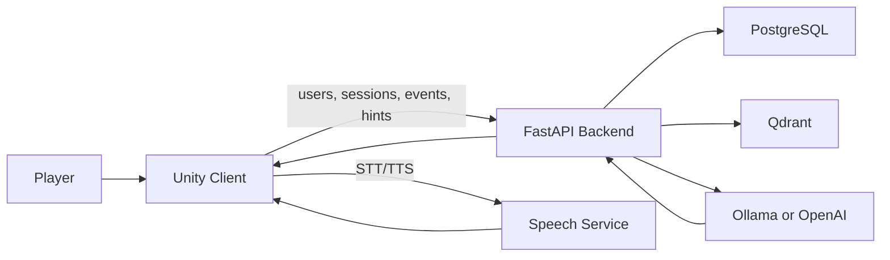

# Context-Aware Virtual Assistant

A Unity and FastAPI prototype for a context-aware virtual assistant inside an
interactive pipe-puzzle scene. The assistant uses gameplay telemetry, scene
knowledge, conversation memory, speech input/output, and interchangeable LLM
providers to generate short player-facing hints.

## What This Project Contains

- A Unity pipe-puzzle client with text chat, voice input, provider switching,
  local puzzle saves, clean session reset, and puzzle completion flow.
- A FastAPI backend for users, sessions, gameplay events, context aggregation,
  semantic memory, prompt construction, and hint generation.
- A separate speech service for local and cloud speech-to-text/text-to-speech.
- PostgreSQL for structured gameplay/session data.
- Qdrant for semantic conversation memory.
- Ollama and OpenAI LLM provider support.
- A deterministic evaluation runner for comparing provider, context, and memory
  configurations.

## Architecture


```mermaid
flowchart LR
    Player["Player"]
    Unity["Unity Client"]
    Backend["FastAPI Backend"]
    Speech["Speech Service"]
    Postgres["PostgreSQL"]
    Qdrant["Qdrant"]
    LLM["Ollama or OpenAI"]

    Player --> Unity
    Unity -->|users, sessions, events, hints| Backend
    Unity -->|STT/TTS| Speech
    Backend --> Postgres
    Backend --> Qdrant
    Backend --> LLM
    LLM --> Backend
    Backend --> Unity
    Speech --> Unity
```

## Repository Layout

```text
.
|-- Backend/
|   |-- backend_service/      # Main FastAPI backend
|   |-- speech_service/       # STT/TTS FastAPI service
|   |-- docker-compose.yml
|   `-- run.sh
|-- Unity Client/             # Unity project
|-- Deployment/               # Exported Windows build; contains the runnable .exe
|-- Evaluation/               # Evaluation runner and test cases
|-- Diagrams/
|-- LICENSE
`-- README.md
```

Important Unity script folders:

```text
Unity Client/Assets/Scripts/API        # Backend and speech API clients
Unity Client/Assets/Scripts/Context    # Event logging and scene state
Unity Client/Assets/Scripts/LLM        # LLM provider selection
Unity Client/Assets/Scripts/Managers   # Chat, voice, user, session managers
Unity Client/Assets/Scripts/Pipes      # Pipe and slot logic
Unity Client/Assets/Scripts/Puzzle     # Knowledge loading and local saves
Unity Client/Assets/Scripts/Speech     # Wake word and voice recording
Unity Client/Assets/Scripts/UI         # Menu, chat, voice, pause, end screens
```

## Prerequisites

- Git
- Docker and Docker Compose
- Bash-compatible shell for `Backend/run.sh`, such as WSL, Git Bash, or Linux/macOS
- Unity Editor compatible with the project version in
  `Unity Client/ProjectSettings/ProjectVersion.txt`
- Python 3 for the evaluation runner
- Ollama if you want to use the local LLM provider
- OpenAI API key if you want OpenAI LLMs or OpenAI embeddings
- Google Cloud credentials if you want Google STT/TTS

## First-Time Setup

Clone the repository and enter the repo root:

```bash
git clone <repository-url>
cd <repository-folder>
```

Create the backend secret directory if it does not exist:

```bash
mkdir -p Backend/backend_service/secrets
```

For OpenAI support, create this file:

```text
Backend/backend_service/secrets/open-ai.txt
```

The file should contain only the API key.

For Google speech support, place the Google service-account JSON at:

```text
Backend/speech_service/secrets/virtual-ai-assistant.json
```

For local speech support, the speech service expects model files under:

```text
Backend/speech_service/data/models/vosk-model-en-us-0.22
Backend/speech_service/data/models/piper/en_US-joe-medium.onnx
```

The Piper model may also require its companion JSON/config file in the same
folder, depending on the downloaded voice package.

## Backend Configuration

The Docker Compose stack provides the main configuration:

```text
Backend/backend_service/secrets/open-ai.txt     # OpenAI API key
Backend/speech_service/secrets/                 # Optional Google credentials
Backend/speech_service/data/models/             # Optional local speech models
```

Default backend values in `Backend/docker-compose.yml` include:

```text
Backend API:        http://localhost:8000
Speech API:         http://localhost:8001
Qdrant dashboard:   http://localhost:6333/dashboard
PostgreSQL:         localhost:5433
Ollama model:       qwen2.5:7b
OpenAI model:       gpt-5.4-mini
Embedding model:    text-embedding-3-small
```

If you use Ollama, make sure the model is available on the host:

```bash
ollama pull qwen2.5:7b
```

## Running the Backend

From the repository root:

```bash
cd Backend
./run.sh
```

To rebuild the Docker images:

```bash
cd Backend
./run.sh --build
```

The helper script detects the host IP for Ollama and exports `OLLAMA_BASE_URL`
before starting Docker Compose.

If you are not using `run.sh`, set `OLLAMA_BASE_URL` yourself before running
Docker Compose. For example, on Windows PowerShell with Docker Desktop:

```powershell
cd Backend
$env:OLLAMA_BASE_URL = "http://host.docker.internal:11434"
docker compose up --build
```

Health checks:

```bash
curl http://localhost:8000/health
curl http://localhost:8001/health
```

## Running the Unity Client

### Option 1: Run From Unity

1. Open the `Unity Client` folder in Unity.
2. Start the backend stack.
3. Enter Play Mode.
4. Create or select a user.
5. Press Continue to start a session and enter the puzzle scene.
6. Interact with the pipe puzzle.
7. Use text chat or voice input to ask for hints.

Default service URLs expected by the Unity client:

```text
Backend base URL: http://localhost:8000
Speech base URL:  http://localhost:8001
```

The pause menu includes a provider dropdown:

| Mode | LLM | Speech-to-text | Text-to-speech |
| --- | --- | --- | --- |
| Local | Ollama | Vosk | Piper |
| Cloud | OpenAI | Google | Google |

The selected provider mode is stored locally with Unity PlayerPrefs.

### Option 2: Run the Deployed Build

An exported Windows build is included in the deployment folder:

```text
Deployment/Unity Client.exe
```

Run this `.exe` to start the game directly without opening the Unity Editor.
The backend stack still needs to be running before using the assistant features,
because the build connects to the same local service URLs:

```text
Backend base URL: http://localhost:8000
Speech base URL:  http://localhost:8001
```

Keep `Unity Client.exe`, `UnityPlayer.dll`, `UnityCrashHandler64.exe`,
`Unity Client_Data/`, and the other files inside `Deployment/` together. Unity
builds depend on the adjacent data folder, so moving only the `.exe` elsewhere
can prevent the exported application from starting correctly.

## Gameplay Flow

1. The player creates/selects a user.
2. Unity starts a backend session.
3. Pipe interactions are logged as gameplay events.
4. Unity sends scene state and puzzle knowledge with hint requests.
5. The backend combines scene state, recent events, puzzle knowledge, and
   semantic memory.
6. The selected LLM provider generates a short hint.
7. User and assistant messages are stored in Qdrant as chat memory.
8. Puzzle placements are saved locally so the user can return later.
9. When all slots are correct, Unity shows the end screen and clears the local
   puzzle save.

## Evaluation

The `Evaluation` folder contains a deterministic runner that sends simulated
pipe-puzzle states to the backend and writes comparison files.

From the repo root:

```bash
python Evaluation/run_evaluation.py --backend-url http://localhost:8000 --output-dir Evaluation/exports --repetitions 3 --seed-memory --reset-evaluation-memory
```

On Windows, `py` can be used instead of `python`:

```bat
py Evaluation\run_evaluation.py --backend-url http://localhost:8000 --output-dir Evaluation\exports --repetitions 3 --seed-memory --reset-evaluation-memory
```

See [Evaluation/README.md](Evaluation/README.md) for the full evaluation guide.

## Output and Data

PostgreSQL stores:

- users
- sessions
- gameplay events
- session metadata

Qdrant stores:

- user chat messages
- assistant chat messages
- semantic vectors used for memory retrieval

Unity stores locally:

- selected provider settings
- selected user
- current puzzle save state

## Troubleshooting

- If OpenAI requests fail, confirm
  `Backend/backend_service/secrets/open-ai.txt` exists and contains a valid key.
- If local Ollama requests fail, confirm Ollama is running on the host and the
  configured model has been pulled.
- If local speech fails, confirm the Vosk and Piper model files exist under
  `Backend/speech_service/data/models`.
- If Google speech fails, confirm
  `Backend/speech_service/secrets/virtual-ai-assistant.json` exists and has
  access to Google Speech-to-Text and Text-to-Speech.
- If Unity cannot reach the backend, confirm Docker services are healthy and the
  Unity base URLs point to `http://localhost:8000` and `http://localhost:8001`.
- If evaluation memory counts are zero, run the evaluation with
  `--seed-memory --reset-evaluation-memory` and confirm Qdrant plus OpenAI
  embeddings are configured.

## Current Limitations

- The Unity prototype focuses on one pipe-puzzle scene.
- Local model performance depends on host hardware.
- Speech quality depends on microphone quality and selected provider.
- Database migrations are not formalized; tables are initialized by SQLAlchemy.
- This is a dissertation prototype, not a production deployment.

## License

This project is licensed under the terms included in [LICENSE](LICENSE).
